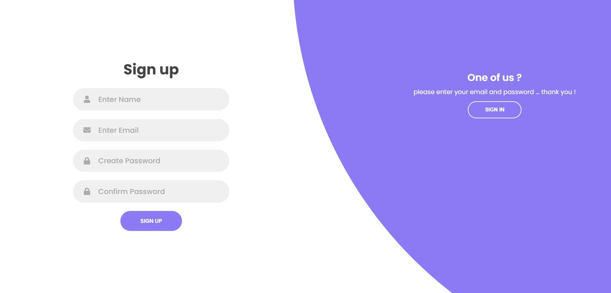
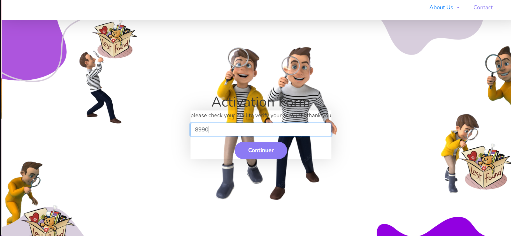
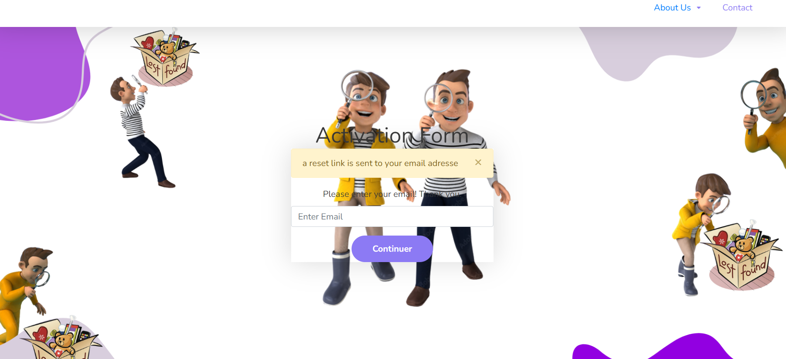

ons jabbes
# User Authentication System 🛡️

This repository contains a user authentication system with features including user registration, login, and email verification. It provides a basic template that can be used and extended for various web applications.

## Features ✨

- *User Signup:* Allows users to create an account with email and password. ✉️
- *User Login:* Enables users to log in with their credentials. 🔑
- *Email Verification:* Sends a verification email to users upon registration to confirm their email address. 📧
- *Password Management:* Users can reset their passwords if forgotten. 🔄

## Tech Stack 🛠️

- *Backend:* Node.js, Express.js
- *Frontend:* React , ejs
- *Database:* MongoDB 
- *Email Service:* 

## Getting Started 🚀

### Prerequisites

- Node.js (v14 or higher)
- npm or yarn
- MongoDB (or your database setup)
- An email service provider account (e.g., SendGrid, Mailgun)

### Installation

1. *Clone the repository:*

    
    git clone https://github.com/yourusername/authentication-system.git
    cd authentication-system
    

2. *Install backend dependencies:*

    
    
    npm install
    

3. *Install frontend dependencies:*

    
   
    npm install
    

4. *Set up environment variables:*

    Create a .env file in both the backend and frontend directories and add the required variables.

    *Backend (.env):*

    
    PORT=5000
    MONGO_URI=your_mongodb_uri
    JWT_SECRET=your_jwt_secret
    EMAIL_SERVICE_API_KEY=your_email_service_api_key
    

    *Frontend (.env):*

    
    REACT_APP_API_URL=http://localhost:5000
    

5. *Start the backend server:*

    
    
    npm start
    

## Usage 📚

### Signup

Navigate to the signup page of the application, enter your details, and submit the form. You will receive a verification email to confirm your registration. 📝

### Login

After verifying your email, navigate to the login page, enter your credentials, and access the application. 🔒

### Email Verification

Check your email for a verification link sent upon registration. Click the link to activate your account. 🔗

### password reset

In case you forgot your password a verification link is sent to your email so you can change it .

## Screenshots 📸

### Signup Page

### Login Page

### Email Verification

###poassword reset

## Contributing 🤝

1. Fork the repository.
2. Create a new branch: git checkout -b feature/your-feature.
3. Commit your changes: git commit -am 'Add new feature'.
4. Push to the branch: git push origin feature/your-feature.
5. Create a new Pull Request.

